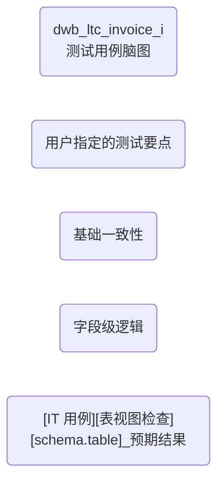

# ai4test_generator Skill

**版本**: 1.0.0  
**作者**: AI Assistant  
**描述**: 数仓测试用例自动化生成技能，根据 Mapping 文档、表结构 DDL、需求文档 (RS/TS) 生成符合规范的测试用例及验证 SQL

---

## 能力范围

本 Skill 提供以下能力：

1. **测试用例脑图生成** - 根据 Mapping、TS、RS 文档自动生成测试用例思维导图
2. **测试用例详细生成** - 将脑图转换为结构化的测试用例 JSON
3. **SQL 自动生成** - 为每个测试用例生成 GAUSS DB 验证 SQL
4. **数据库执行验证** - 自动执行 SQL 并返回 PASS/FAIL 结果
5. **Excel 导出** - 将测试用例导出为 Excel 文件
6. **完成通知** - 通过 welink/Outlook 发送任务完成通知

---

## 输入参数

### 必需参数

| 参数名 | 类型 | 说明 | 示例 |
|--------|------|------|------|
| `mapping` | file | Mapping 映射文档（Excel 格式，.xlsx/.xls） | `mapping.xlsx` |
| `TS` | file | 表结构设计文档（Word/PDF） | `TS.docx` |
| `w3_id` | string | 用户工号（接收通知） | `q00797588` |

### 输入处理说明

| 输入文件 | 原始格式 | 处理方式 | 转换后格式 |
|----------|----------|----------|------------|
| `mapping` | Excel 表格 | 读取 Excel 并转换为 Markdown 表格 | Markdown 表格 |
| `TS` | Word/PDF | 提取文本内容 | 纯文本 |
| `RS` | Word/PDF | 提取文本内容 | 纯文本 |

### 可选参数

| 参数名 | 类型 | 说明 | 默认值 |
|--------|------|------|--------|
| `RS` | file | 需求规格文档 | null |
| `DDL` | string | 建表语句 | null |
| `query` | string | 用户当前输入/指令 | null |

---

## 输出格式

### 阶段 1: 测试用例脑图 (Mermaid)



### 阶段 2: 结构化测试用例 (JSON)

```json
[
  {
    "case_name": "目标表主键不重复校验",
    "level": "level1",
    "pre_condition": "源表任务已完成",
    "need_generate_sql": true,
    "eval_step_descri": "SELECT COUNT(*) FROM table",
    "expected_result": "无重复主键",
    "tags": "IT 用例表视图"
  }
]
```

### 阶段 3: Excel 文件

通过 HTTP 服务生成，返回 base64 编码的 Excel 文件内容。

---

## 使用方式

### 基础用法

```bash
# 上传文件并生成测试用例
/skill ai4test_generator \
  --mapping ./docs/mapping.md \
  --TS ./docs/TS.docx \
  --w3_id q00797588
```

### 完整用法

```bash
/skill ai4test_generator \
  --mapping ./docs/mapping.md \
  --TS ./docs/TS.docx \
  --RS ./docs/RS.docx \
  --DDL "CREATE TABLE schema.table (...)" \
  --w3_id q00797588 \
  --query "请生成包含分区验证的测试用例"
```

---

## 执行流程

```
┌─────────────┐     ┌─────────────┐     ┌─────────────┐
│  1. 文档解析  │ ──→ │  2. 意图识别 │ ──→ │  3. 路由分发 │
└─────────────┘     └─────────────┘     └─────────────┘
                                              │
                    ┌─────────────────────────┼─────────────────────────┐
                    │                         │                         │
                    ▼                         ▼                         ▼
           ┌───────────────┐        ┌───────────────┐        ┌───────────────┐
           │ class=1 闲聊 │        │ class=2 确认  │        │ class=3 生成  │
           │ 非任务回复    │        │ 生成详细用例  │        │ 生成脑图      │
           └───────────────┘        └───────────────┘        └───────────────┘
```

### 详细步骤

1. **文档解析**: 提取 Mapping、TS、RS 文档内容
2. **意图识别**: LLM 分类用户输入 (class_type: 1/2/3/4)
3. **测试要点提取**: 从 RS 文档提取测试要点
4. **知识检索**: 从知识库检索测试用例规范
5. **脑图生成**: Agent 生成 Mermaid 格式脑图
6. **用户确认**: 等待用户确认脑图
7. **迭代生成**: 遍历每个测试用例生成 SQL 并验证
8. **结果导出**: 生成 Excel 并发送通知

---

## 意图分类说明

| class_type | 名称 | 触发场景 | 处理方式 |
|------------|------|----------|----------|
| 1 | 闲聊/引导 | 材料缺失、咨询问题、打招呼 | 非任务式 LLM 回复 |
| 2 | 确认执行 | 用户认可脑图，要求生成用例 | 进入详细用例生成 |
| 3 | 初次生成 | 用户提供材料，请求开始 | 生成脑图 |
| 4 | 其他 | 无法识别的意图 | 闲聊回复 |

---

## 约束条件

1. **数量限制**: 最终测试用例不超过 20 个
2. **L3 描述**: 禁止模糊表达，必须定义具体指标
3. **字段引用**: 涉及验证的字段/表/视图必须明确标出
4. **Schema 要求**: 对象命名需带 schema
5. **SQL 规范**: GAUSS DB 关键词需小写

---

## 依赖工具

| 工具名 | 类型 | 用途 |
|--------|------|------|
| `database_query_with_sql` | workflow | 执行 GAUSS DB SQL |
| `knowledge_test_case_sql` | workflow | 检索知识库 few-shot |
| `send_msg` | workflow | 发送 welink/邮件通知 |
| `code` | builtin | 代码解释器 |
| `generate_excel` | HTTP | Excel 生成服务 |

---

## 错误处理

| 错误场景 | 处理策略 |
|----------|----------|
| RS 文档不存在 | 赋值为"不涉及"，继续流程 |
| 测试要点提取失败 | LLM 兜底提取 |
| SQL 执行报错 | Agent 迭代修正（最多 3 次） |
| 知识库检索为空 | 输出提示信息 |
| Excel 生成失败 | HTTP 重试 3 次 |

---

## 版本历史

| 版本 | 日期 | 变更说明 |
|------|------|----------|
| 1.0.0 | 2026-04-11 | 初始版本 |

---

## 相关文件

- `examples/` - 使用示例
- `scripts/` - 辅助脚本
- `ai4test.yml` - Dify 工作流定义文件
