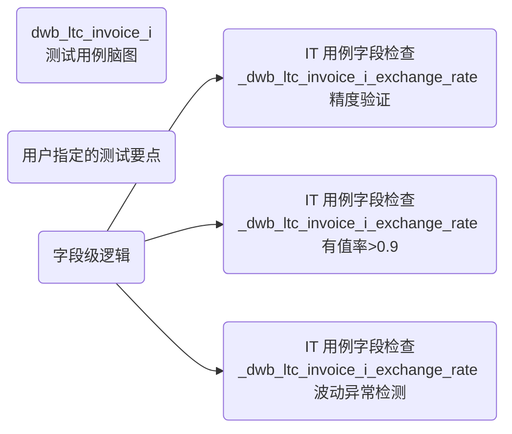

# 高级用法示例

## 场景 4: 带 RS 文档的完整生成流程

用户提供完整的 Mapping、TS、RS 三份文档。

### 输入文件

**mapping.md**:
```markdown
| 目标字段 | 来源表 | 来源字段 | 转换规则 |
|----------|--------|----------|----------|
| invoice_id | dwb_ltc_invoice_src | invoice_id | 直接复制 |
| amount_usd | dwb_ltc_invoice_src | amount_usd | 直接复制 |
| amount_rmb | dwb_ltc_invoice_src | amount_rmb | 直接复制 |
| exchange_rate | dwb_ltc_exchange_rate | rate | JOIN 关联 |

| 表级 mapping |
|--------------|
| FROM dwb_ltc_invoice_src a |
| JOIN dwb_ltc_exchange_rate b ON a.currency_code = b.currency_code |
| WHERE a.status = 'COMPLETED' AND a.YYYYMM >= '202501' |
```

**TS.docx**:
```
表名：fin_dwb.dwb_ltc_invoice_i
类型：事实表
分布方式：哈希分布 (invoice_id)
分区键：YYYYMM
主键：invoice_id
本次变更：新增 exchange_rate 字段
```

**RS.docx**:
```
2.1.2 测试要点

1. 验证目标表与源表记录数一致
2. 验证金额字段转换正确 (RMB/USD 汇率校验)
3. 验证新增字段 exchange_rate 有值率>0.9
4. 验证按 YYYYMM 分区数据不倾斜
```

### 预期输出

系统会优先使用 RS 文档中提取的测试要点，生成针对性的测试用例。

---

## 场景 5: 特定字段验证

用户要求针对特定字段生成深度测试用例。

### 输入

```
用户上传文件后，输入:
"请重点验证 exchange_rate 字段的转换逻辑，需要包含：
1. 汇率来源表关联正确性
2. 汇率精度验证 (保留 6 位小数)
3. 汇率为空时的兜底逻辑
4. 汇率波动异常检测 (>10% 需要告警)"
```

### 预期输出

系统会在脑图中增加专门的字段验证分支：



---

## 场景 6: 批量生成多个表的测试用例

用户需要为一批表生成测试用例。

### 输入

```
用户上传多个文件:
- mapping_table1.md
- mapping_table2.md
- TS_batch.docx (包含多个表的设计)

用户输入:
"为 TS 文档中的所有表生成测试用例，每个表不超过 10 个测试用例"
```

### 处理方式

系统会：
1. 解析 TS 文档，识别所有目标表
2. 为每个表独立生成脑图
3. 依次处理每个脑图生成详细用例
4. 合并输出为一个 Excel 文件（按 sheet 分页）

---

## 场景 7: 自定义测试规范

用户有特殊的测试规范要求。

### 输入

```
用户上传文件后，输入:
"我们部门有特殊的测试规范：
1. 所有字段必须验证空值率
2. 金额字段需要增加币种一致性检查
3. 时间字段需要验证YYYYMM 格式正确性
4. 需要生成数据质量报告

请按照这个规范生成测试用例"
```

### 处理方式

系统会：
1. 记录用户的特殊规范（对话上下文）
2. 在脑图生成时融入这些规范
3. 在详细用例生成时体现这些要求

---

## 场景 8: SQL 调试模式

用户需要查看和调试生成的 SQL。

### 输入

```
在生成 SQL 后，用户输入:
"这条 SQL 的执行结果是 FAIL，请帮我分析原因并修正"
```

### 处理方式

系统会：
1. 重新检查 mapping 和 DDL
2. 查询表结构确认字段名
3. 修正 SQL 语法或逻辑
4. 重新执行验证

---

## 输入文件模板

### Mapping 文档模板

```markdown
# 表级 Mapping

| 序号 | 目标表 | 来源表 | 关联条件 | 过滤条件 |
|------|--------|--------|----------|----------|
| 1 | fin_dwb.table_i | src.table_a | a.id = b.id | a.status = 'Y' |
| 2 | fin_dwb.table_i | src.table_b | - | b.date >= '20250101' |

# 字段级 Mapping

| 目标字段 | 来源字段 | 转换规则 | 说明 |
|----------|----------|----------|------|
| id | id | 直接复制 | 主键 |
| name | name | 直接复制 | 名称 |
| amount | amount * rate | 计算 | 金额转换 |
| create_time | TO_TIMESTAMP(create_date) | 函数转换 | 时间格式化 |
```

### TS 文档模板

```markdown
# 表结构设计文档

## 1. 功能简要说明

本表用于存储 XXX 业务数据，为下游提供 XXX 服务。

## 2. 物理模型设计

| 属性 | 值 |
|------|-----|
| 目标表名 | fin_dwb.table_i |
| 临时表 | fin_dwb.table_tmp |
| 事实表 | fin_dwb.table_f |
| 分布方式 | 哈希分布 (id) |
| 分区键 | YYYYMM |
| 主键 | id |

## 3. 本次变更内容

| 变更编号 | 变更类型 | 变更详情 |
|----------|----------|----------|
| IR001 | 新增字段 | 新增 status 字段 |
```

### RS 文档模板

```markdown
# 需求规格说明书

## 2.1 测试要点

### 2.1.1 数据一致性检查
1. 验证来源表与目标表记录数一致
2. 验证主键唯一性

### 2.1.2 字段检查
1. 验证 status 字段枚举值有效性
2. 验证金额字段精度正确

### 2.1.3 性能检查
1. 验证任务执行时长<30min
```
